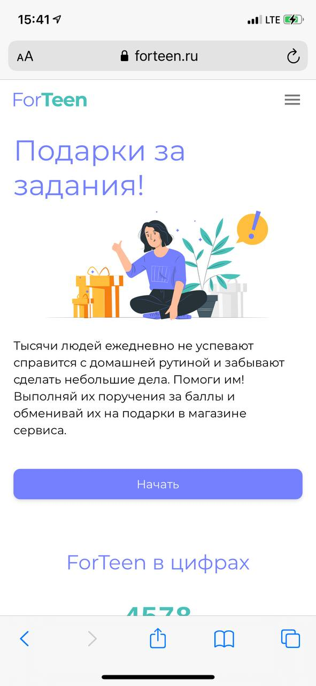
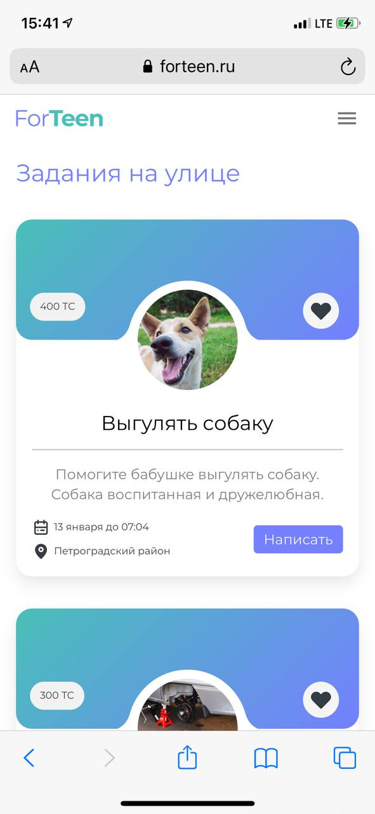
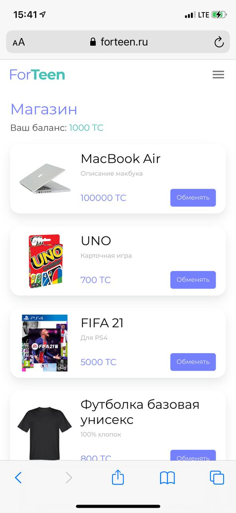
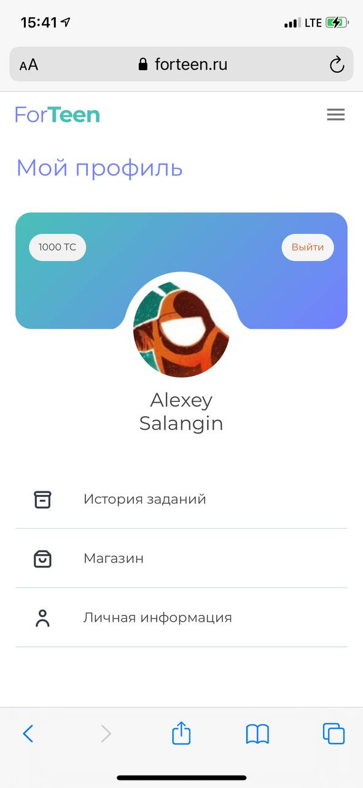

    

**ForTeen** – part-time job search service for teenagers from the age of 14.

Developed as a student project for course "Creating product standards for web interfaces". This is my first experience with web technologies therefore go easy on it.

Important: This is just a prototype. Partially implemented client's user story.
To run the project, you need to replace the authorization tokens (Firebase and AirTable) in the code with the fresh ones.

   
